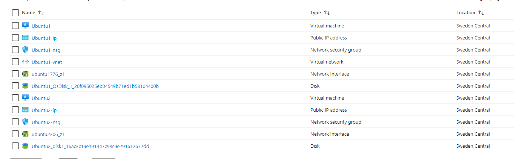
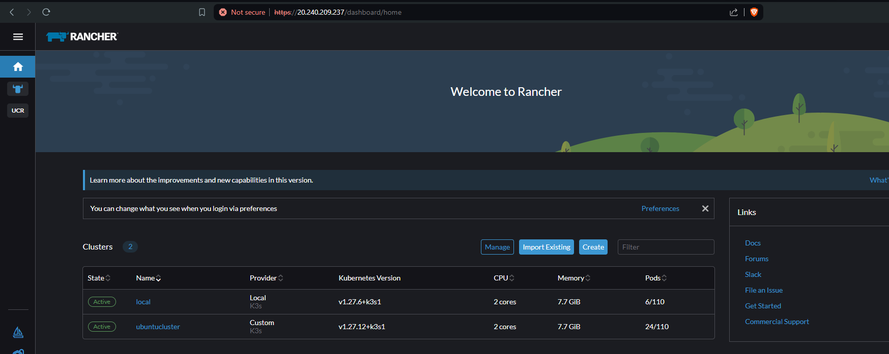
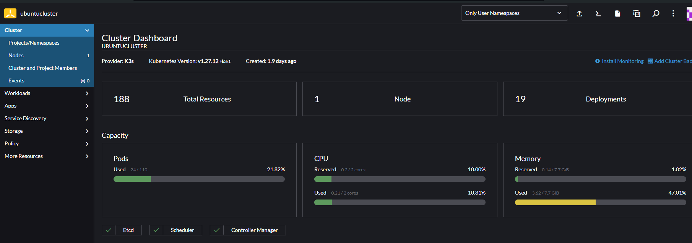
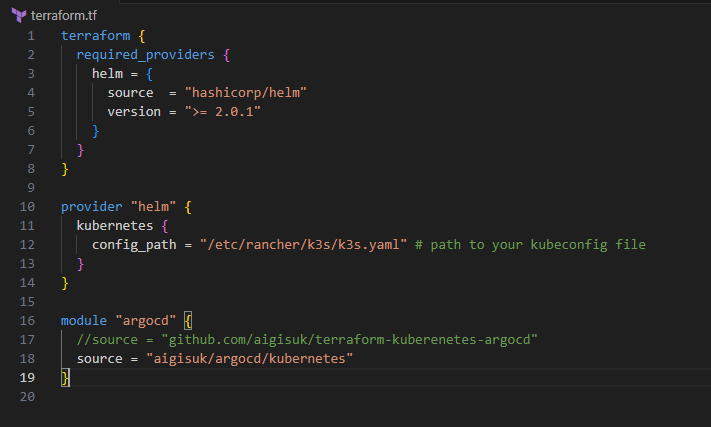
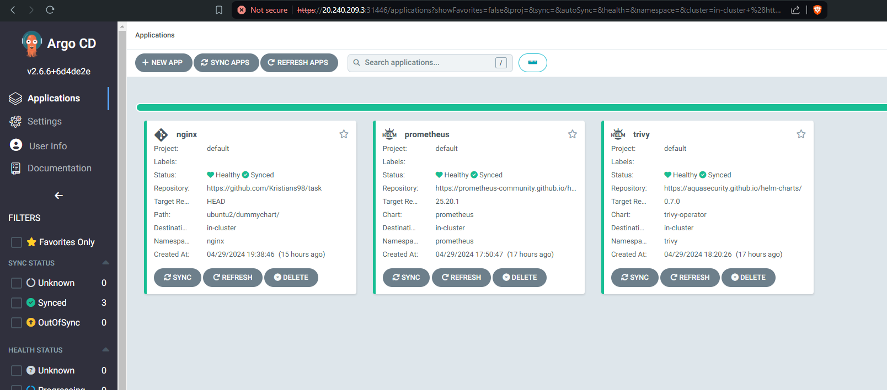
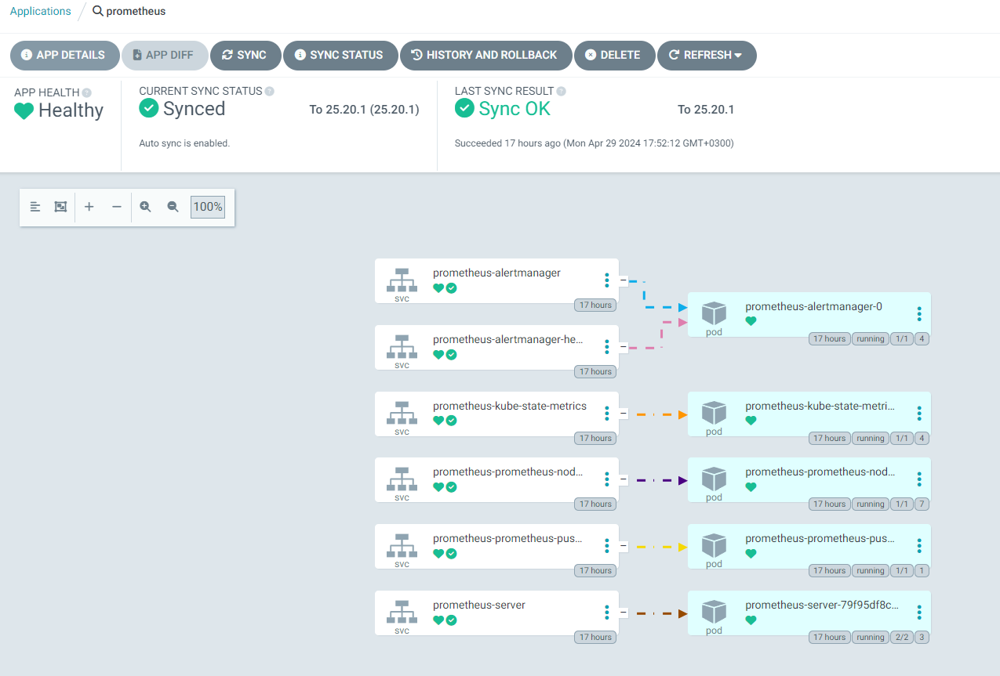
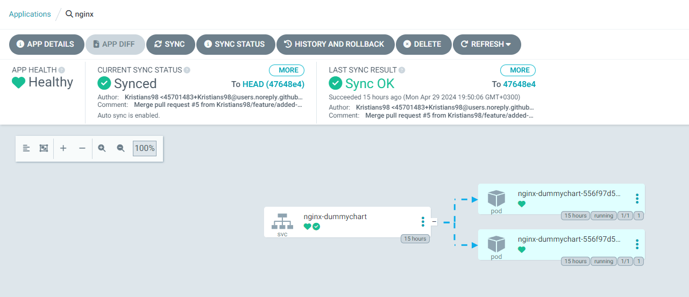

# Task
## Step 1
I have created two virtual machines in a single Resource group in Azure

## Step 2
Installed Rancher un VM1

## Step 3
Used Rancher to deploy k3s cluster on VM2

## Step 4
Used terraform to install ArgoCD on VM2 cluster

## Step 5
Installed Prometheus and Trivy using ArgoCD and created necessary repository structure

## Step 6
Added dummy Helm chart and installed it with ArgoCD

